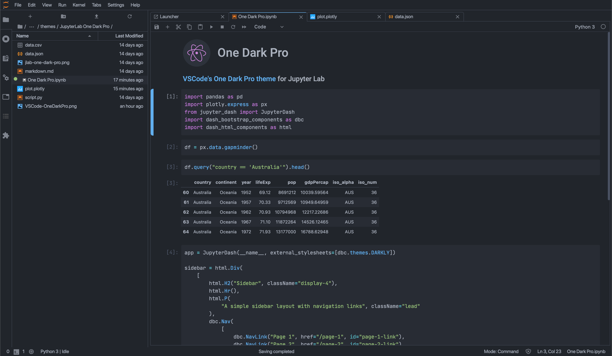

<span>
    
    <h1>One Dark Pro for JupyterLab</h1>
</span>

A full IDE build of [VSCode's One Dark Pro](https://marketplace.visualstudio.com/items?itemName=zhuangtongfa.Material-theme) theme for JupyterLab



## Beyond a simple syntax highlighter

Features modern IDE padding, borders, hover effects and rounded corners.

Extends to:

- **Help view:**


- **Tooltips:**


- **Tracebacks:**


- **and more**

## Prerequisites

* JupyterLab 2

## Installation

As with any JupyterLab 1 or 2 extension, a rebuild will be necessary after installing this theme. Each of the installation methods below will automatically prompt for a rebuild.

### Terminal

```bash
jupyter labextension install jupyterlab_onedarkpro
```

### JupyterLab UI

1. Open JupyterLab
2. Click on Extensions tab in sidebar (puzzle piece)
3. Enable Extensions (if not done already)
4. Seach for `onedarkpro`
5. Click `Install` under `jupyterlab_onedarkpro`
6. Follow the prompts to rebuild JupyterLab


## Development

For a development install (requires npm version 4 or later), do the following in the repository directory:

```bash
npm install
jupyter labextension link .
```

To rebuild the package and the JupyterLab app:

```bash
npm run build
jupyter lab build
```
